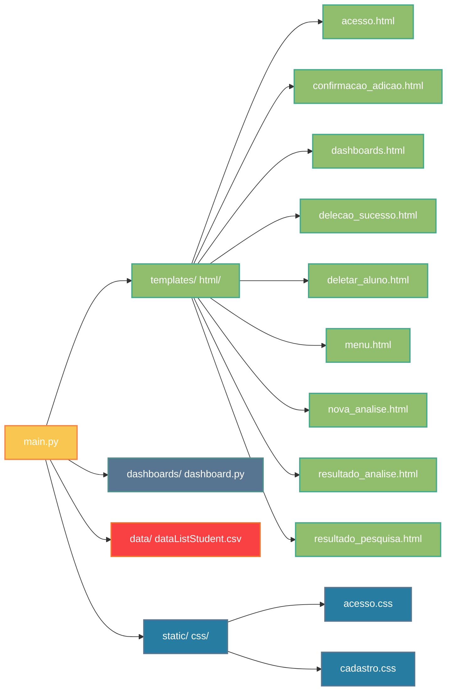

```mermaid
graph LR
    A[main.py] --> B[templates/ html/]
    B --> acesso.html
    B --> confirmacao_adicao.html
    B --> dashboards.html
    B --> delecao_sucesso.html
    B --> deletar_aluno.html
    B --> menu.html
    B --> nova_analise.html
    B --> resultado_analise.html
    B --> resultado_pesquisa.html
    
    A --> C[dashboards/ dashboard.py]
    A --> D[data/ dataListStudent.csv]
    
    A --> E[static/ css/]
    E --> acesso.css
    E --> cadastro.css

    %% Definições de classes
    classDef main fill:#f9c74f,stroke:#f9844a,stroke-width:2px,color:#fff;
    classDef templates fill:#90be6d,stroke:#43aa8b,stroke-width:2px,color:#fff;
    classDef dashboard fill:#577590,stroke:#4d908e,stroke-width:2px,color:#fff;
    classDef data fill:#f94144,stroke:#f3722c,stroke-width:2px,color:#fff;
    classDef css fill:#277da1,stroke:#577590,stroke-width:2px,color:#fff;

    %% Atribuição de classes
    class A main;
    class B,acesso.html,confirmacao_adicao.html,dashboards.html,delecao_sucesso.html,deletar_aluno.html,menu.html,nova_analise.html,resultado_analise.html,resultado_pesquisa.html templates;
    class C dashboard;
    class D data;
    class E,acesso.css,cadastro.css css;

```